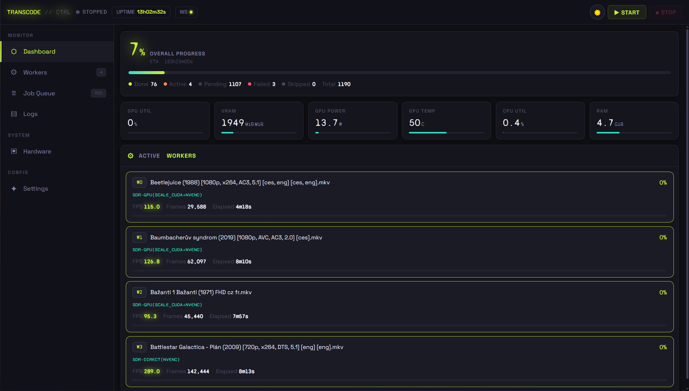

# 🎬 Transcoder // Control

A self-hosted, GPU-accelerated video transcoding pipeline for pre-converting a movie/TV library to HEVC MP4 for Jellyfin direct play. Built for an NVIDIA GPU with a web dashboard for monitoring and control.

---

## Screenshots



---

## Features

- **NVIDIA NVENC** hardware encoding (`hevc_nvenc`) — fast, efficient H.265 output
- **GPU HDR→SDR tonemapping** via `tonemap_cuda` (jellyfin-ffmpeg) — no CPU bottleneck on HDR content
- **GPU scaling** via `scale_cuda` with CPU fallback
- **Parallel workers** — configurable job count, semaphore-limited NVENC sessions
- **nvidia-patch** support — detects unlimited NVENC sessions automatically
- **Embedded subtitle handling** — text subs embedded as `mov_text`; ASS/SSA also extracted as sidecar `.ass` files
- **DVD concat support** — handles `VIDEO_TS/` and flat VOB structures automatically
- **TV show mode** — mirrors Season/Episode folder structure in output
- **Sidecar file copying** — `.nfo`, posters, subtitles copied alongside transcoded files
- **Web dashboard** — real-time worker status, GPU/CPU metrics, job queue, log viewer
- **Dark/light theme** — toggle in the UI, preference saved locally
- **Mobile-friendly** — responsive layout with bottom navigation on small screens
- **Automatic CPU fallback** — pipeline errors trigger retry with software pipeline

---

## Stack

| Component | Technology |
|-----------|-----------|
| Transcoder engine | Python 3.10, jellyfin-ffmpeg 7.x |
| Backend API | FastAPI + uvicorn |
| Frontend | Single-file HTML/JS/CSS |
| Database | SQLite (WAL mode) |
| Container | Docker + NVIDIA Container Toolkit |
| GPU | NVIDIA RTX (tested on RTX 3060) |

---

## Requirements

- Docker + Docker Compose
- [NVIDIA Container Toolkit](https://docs.nvidia.com/datacenter/cloud-native/container-toolkit/install-guide.html)
- NVIDIA driver ≥ 525 on host
- [nvidia-patch](https://github.com/keylase/nvidia-patch) (optional, removes 3-session NVENC limit)

---

## Quick Start

**1. Clone the repo:**
```bash
git clone https://github.com/kappi/transcoder-control.git
cd transcoder-control
```

**2. Edit `docker-compose.yml`** — set your input and output volume paths:
```yaml
volumes:
  - /your/movies:/input:ro
  - /your/output:/output
```

**3. Build and start:**
```bash
docker compose up -d --build
```

**4. Open the dashboard:**
```
http://localhost:8080
```

**5. Configure and start transcoding:**
- Go to **Settings**, set input/output directories, click **Scan** to verify
- Click **▶ Start** — workers will begin processing

---

## Configuration

All settings are available in the web UI under **Settings**. Key options:

| Setting | Default | Description |
|---------|---------|-------------|
| Workers | 4 | Parallel transcode jobs |
| Max Height | 720 | Downscale target (px) |
| CQ Value | 32 | Quality (lower = better, larger file) |
| NVENC Preset | p4 | Speed/quality tradeoff (p1=fastest, p7=best) |
| Rate Control | vbr | NVENC rate control mode |
| Audio Bitrate | 96k | Per-track AAC bitrate |
| TV Show Mode | off | Preserve Season/Episode folder structure |
| Skip Existing | on | Skip files already transcoded |
| No HW Accel | off | Force CPU-only pipeline |

---

## Pipeline

### HDR content (GPU)
```
CPU decode → format=p010le → hwupload_cuda → scale_cuda → tonemap_cuda → hwdownload → hevc_nvenc
```
Requires `tonemap_cuda` filter (included in jellyfin-ffmpeg). Falls back to CPU zscale+hable if unavailable.

### SDR content (GPU scale)
```
CPU decode → format=nv12 → hwupload_cuda → scale_cuda → hwdownload → hevc_nvenc
```

### Fallback (CPU)
```
CPU decode → scale → zscale (HDR) → tonemap → hevc_nvenc
```
Triggered automatically on pipeline errors.

---

## Output Structure

### Movies
```
/output/
  Movie Title (2024)/
    Movie Title (2024).mp4       ← video + embedded mov_text subs
    Movie Title (2024).eng.ass   ← extracted ASS sidecar (full styling)
    Movie Title (2024).ces.ass
    poster.jpg
    movie.nfo
```

### TV Shows (TV Mode enabled)
```
/output/
  Show Name/
    Season 01/
      Show Name - S01E01.mp4
      Show Name - S01E01.eng.ass
```

---

## Subtitle Handling

| Type | Handling |
|------|----------|
| SRT, WebVTT, mov_text | Embedded in MP4 as `mov_text` |
| ASS / SSA | Embedded as `mov_text` + extracted as `.ass` sidecar |
| PGS, DVDSUB (bitmap) | Dropped — not supported in MP4 |

Jellyfin picks up `.ass` sidecar files automatically for full subtitle styling.

---

## Audio Handling

All audio is re-encoded to **AAC-LC stereo 96k at 48kHz**.

**Language selection:** If any preferred language track is found, only preferred language tracks are kept. Otherwise all tracks are kept. Preferred languages:

| Code | Language |
|------|----------|
| `ces` / `cze` / `cs` | Czech |
| `eng` / `en` | English |
| `jpn` / `ja` | Japanese |
| `zho` / `chi` / `zh` / `cmn` / `yue` | Chinese |

**Surround downmix:** A pan filter mixes surround channels (FC, FL, FR, BL, BR, SL, SR) to stereo. Automatically stripped for stereo/mono sources where those channels don't exist.

**Filter chain applied to all tracks:**
```
pan=stereo|FL=FC+0.60*FL+0.60*BL+0.60*SL|FR=FC+0.60*FR+0.60*BR+0.60*SR,acompressor=threshold=-18dB:ratio=2:attack=20:release=200:makeup=1,alimiter=limit=-1.5dB:level=true
```
- **Pan:** surround-to-stereo downmix — center channel (FC) added to both sides, surround/back channels mixed in at 60%
- **Compressor:** threshold -18dB, ratio 2:1, attack 20ms, release 200ms, makeup gain 1
- **Limiter:** -1.5dB ceiling

Pan filter is automatically stripped for stereo/mono sources where surround channels don't exist.

---

## Access

This tool is designed for **local network use**. For remote access, [Tailscale](https://tailscale.com/) is recommended — zero config, no open ports.

---

## Docker Compose Example

```yaml
services:
  transcoder-web:
    build: .
    container_name: transcoder-web
    restart: unless-stopped
    ports:
      - "8080:8080"
    volumes:
      - /your/movies:/input:ro
      - /your/output:/output
      - ./config:/config
      - ./logs:/logs
    environment:
      - NVIDIA_VISIBLE_DEVICES=all
      - NVIDIA_DRIVER_CAPABILITIES=compute,video,utility
    deploy:
      resources:
        reservations:
          devices:
            - driver: nvidia
              count: 1
              capabilities: [gpu]
```

---

## Development

Both `transcode.py` and `frontend/index.html` are copied into the image at build time — they are **not** volume-mounted.

**Hot-swap without rebuild** (takes effect on next Start):
```bash
docker cp transcode.py transcoder-web:/app/transcode.py
docker cp frontend/index.html transcoder-web:/app/frontend/index.html
```

**Full rebuild:**
```bash
docker compose down
docker compose build --no-cache
docker compose up -d
```

---

## Usage

### Web UI (primary)

Start the container, then open the dashboard in your browser:
```
http://your-server-ip:8080
```

1. Go to **Settings** — set input/output directories, configure encoding options
2. Click **Scan** to verify ffmpeg can see your files
3. Click **▶ Start** — workers begin processing
4. Monitor progress on the **Dashboard** tab
5. Click **■ Stop** to drain gracefully — active files finish before the engine exits

---

### Terminal Monitor (alongside web UI)

Attach a live curses dashboard to the running web UI session — read-only, safe to open and close at any time:

```bash
docker exec -it transcoder-web python3 /app/transcode_monitor.py
```

Keys: `Q` to quit (does not affect the running transcoder).

Test it without a running instance:
```bash
docker exec -it transcoder-web python3 /app/transcode_monitor.py --demo
```

Custom state file path (if changed from default):
```bash
docker exec -it transcoder-web python3 /app/transcode_monitor.py --state-file /tmp/transcode_ui_state.json
```

---

### Terminal UI (standalone, no web stack)

Launch the transcoder directly from the terminal with a built-in curses dashboard — no FastAPI backend or browser needed:

```bash
docker exec -it transcoder-web python3 /app/transcode_ui.py   --input /input   --output /output   --jobs 4   --cq 32   --preset p4   --max-height 720
```

All `transcode.py` flags are forwarded transparently. Keys: `Q` to quit and stop transcoding.

Demo mode (no files needed):
```bash
docker exec -it transcoder-web python3 /app/transcode_ui.py --demo
```

> **Note:** `transcode_ui.py` and the web UI both own the state file — do not run them simultaneously. Use `transcode_monitor.py` if the web UI is already running.

---

## Notes

- **jellyfin-ffmpeg version:** pinned to `7.1.3-3` in the Dockerfile. Update `JFFMPEG_VERSION` to upgrade.
- **Watchdog:** ffmpeg processes that produce no frame progress for 300 seconds are automatically killed and the job marked failed.
- **Network filesystems:** `-movflags +faststart` is used by default, which avoids "unable to re-open output file" errors on NFS/SMB/CIFS output directories.
- **`tonemapx` vs `tonemap_cuda`:** `tonemapx` is a CPU-only software filter despite the name. The GPU filter is `tonemap_cuda`. Do not confuse them.
- **DVD audio:** language tags are often `und` (stored in IFO, not VOB) — all tracks are kept in this case, which is correct behaviour.

---

## License

MIT
